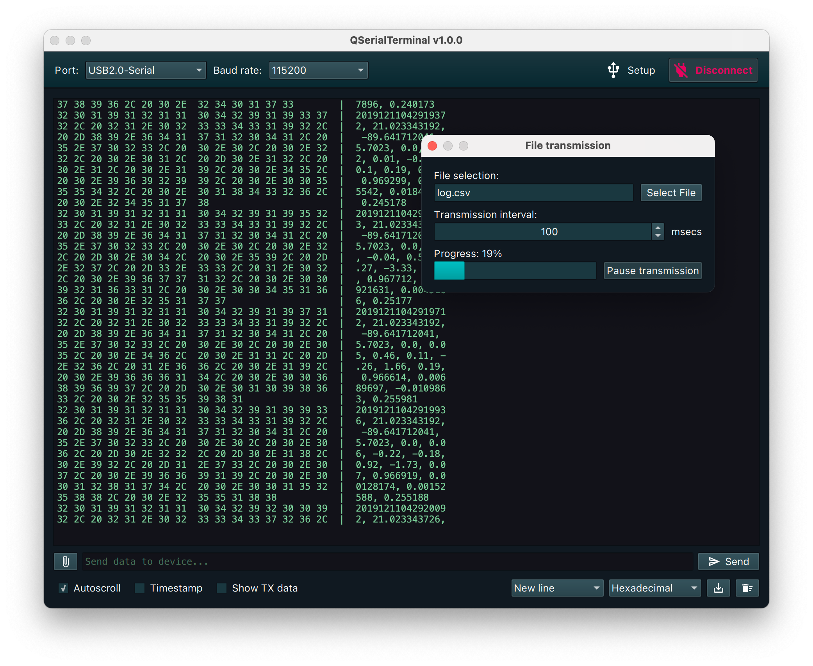

# GHTerminal

Features:
- Display data in text & hexadecimal format
- Line ending control
- Optional autoscrolling
- Export terminal output to file
- File transmission to serial port device

## Compiling the application

Once you have Qt installed, open *QSerialTerminal.pro* in Qt Creator and click the "Run" button.

Alternatively, you can also use the following commands:

	qmake
	make -j4

History：
2022-11-12
- 更改布局  

2023-03-31
- delegate 绑定信号 更改属性
- 增加checkbox 单选 全选

ToDo
- 文件按钮更改为历史
- 修改tx hex闪退
------- 完善 单选全选功能
需要moodel增加checked 属性

- checkbox 单选
是初始时就appand100个信道 还是单选时增加到单选位置
初始appand 打开就慢
单选增加 会增加之前的row之前的所有

考虑未选择的信道 不显示 也不好做

实际A_B 和split是不起作用的，考虑移除或者更改协议

当当前信道和设置信道是相同的时候 Q900要处理显示等 会延迟 
所以会发送两次  是正常的

写信道 如果频率输入在频带外， 则不起作用
如果需要提示 还要将分段表放到上位机

当写频中途将串口断开，需要将进度置0
加了 看书哪里的问题